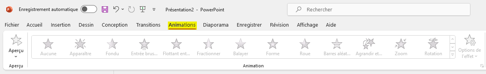

# Ajouter des animations personnalisés dans Powerpoint.

Dans cet article vous verrez la procédure à suivre
pour ajouter des animations personnalisés dans Powerpoint.

**Auteur** : Alexandre Martel-Lafleur  
**Date de création** : 17 février 2024

## Prérequis

<ul>
    <li>Microsoft PowerPoint (Version 2401 Build 16.0.17231.20236) 64 bits </li>
</ul>

## Procédure

<ol>
   <li>Pour commencer, ouvrer Powerpoint et cliquez sur **Nouvelle présentation** sous l'onglet
   **Nouveau** de la barre latérale à gauche afin de créer une nouvelle présentation.</li>

<li>Une fois la présentation créée, ajoutez l'élément que vous souhaitez animer, ça
peut être du **texte**, une **image** ou encore une **forme**.</li>

<li>Une fois que vous avez ajouter tous les éléments que vous voulez animer, 
naviguez sous l'onglet **Animations**.</li>

<li>Ensuite, sélectionnez le premier élément que vous désirez animez.</li>

<li>Une fois l'élément sélectionné, les différentes options d'animations seront disponibles.
Il suffit donc de choisir l'animation que vous voulez comme par exemple celle intitulée **Fondu**.</li>

<li>Une fois l'animation appliquée, vous pouvez choisir quand est-ce que l'animation va débuter.
Par exemple, pour que l'animation débute au clic de la souris vous devez sélectionnez **Au clic**.</li>

<li>Vous pouvez également indiquer le **délai** de l'animation.
Par exemple, **02,00** pour un délai de **2 secondes**.</li>

Répétez les étapes 4 à 7 pour animer d'autres éléments au besoin.

</ol>
