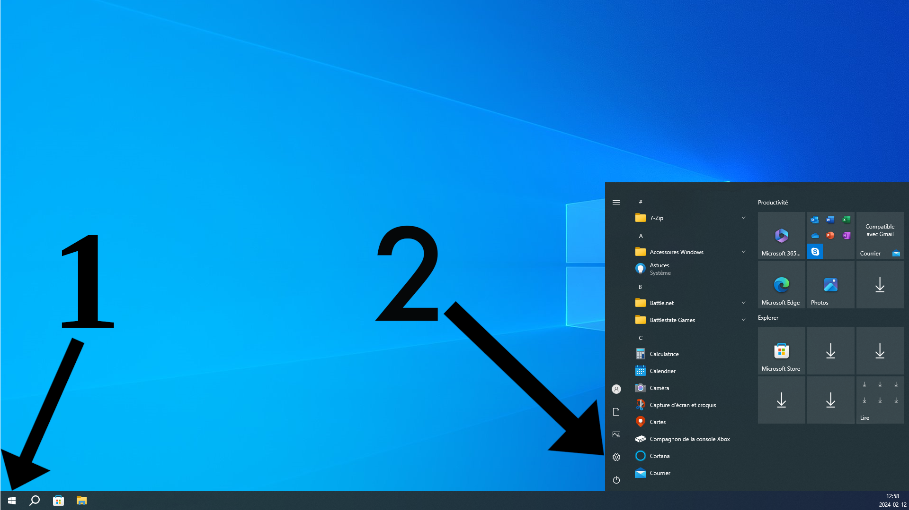
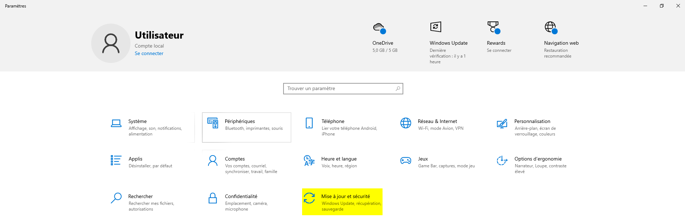
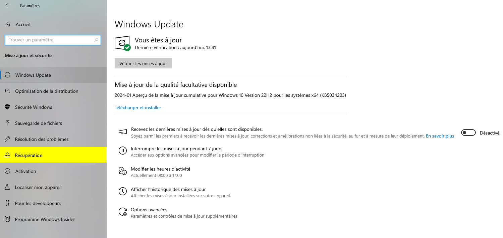
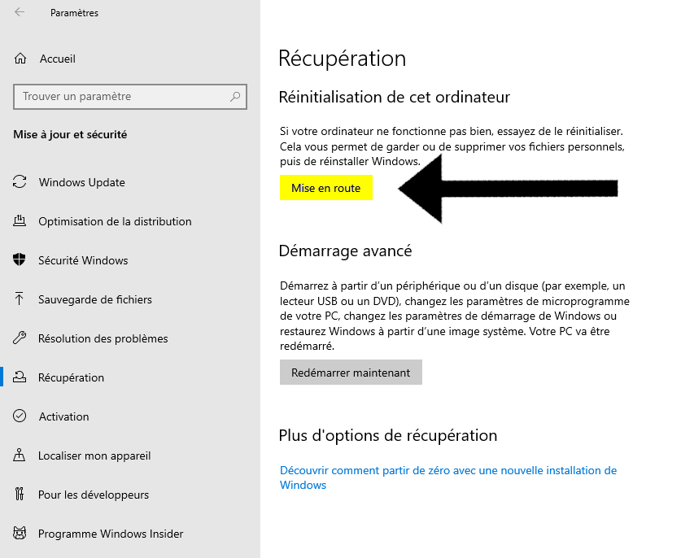
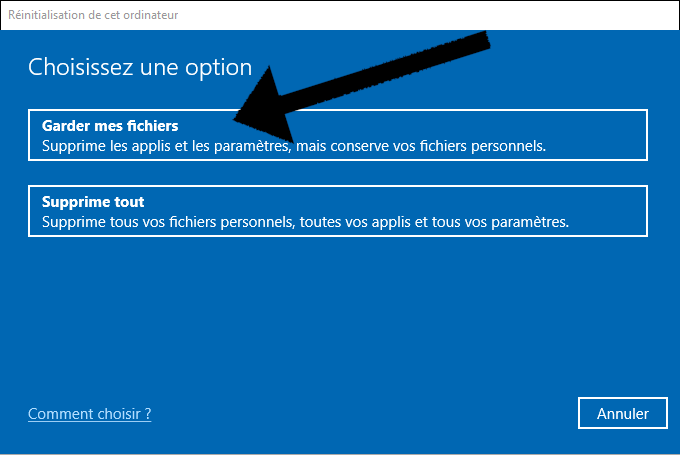
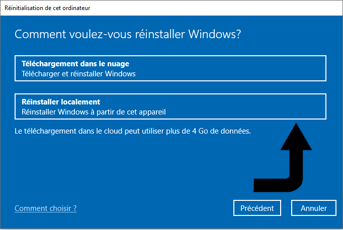
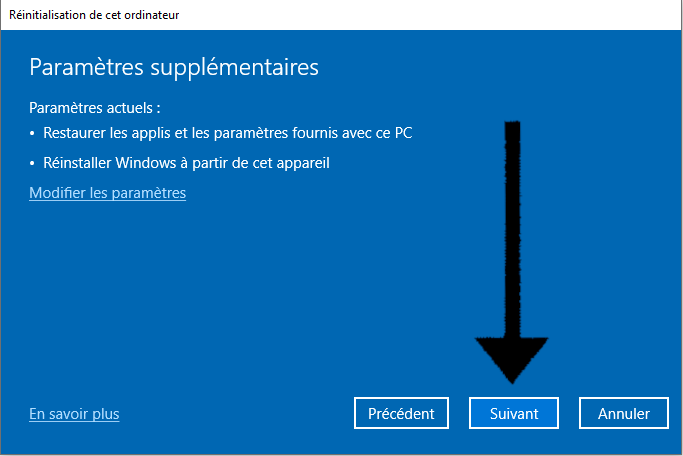
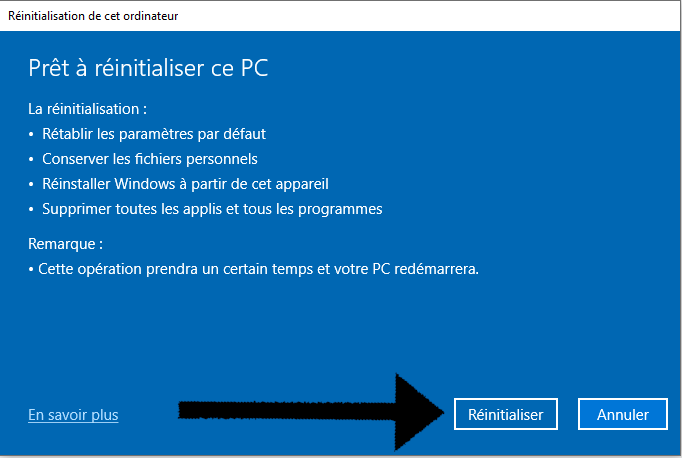
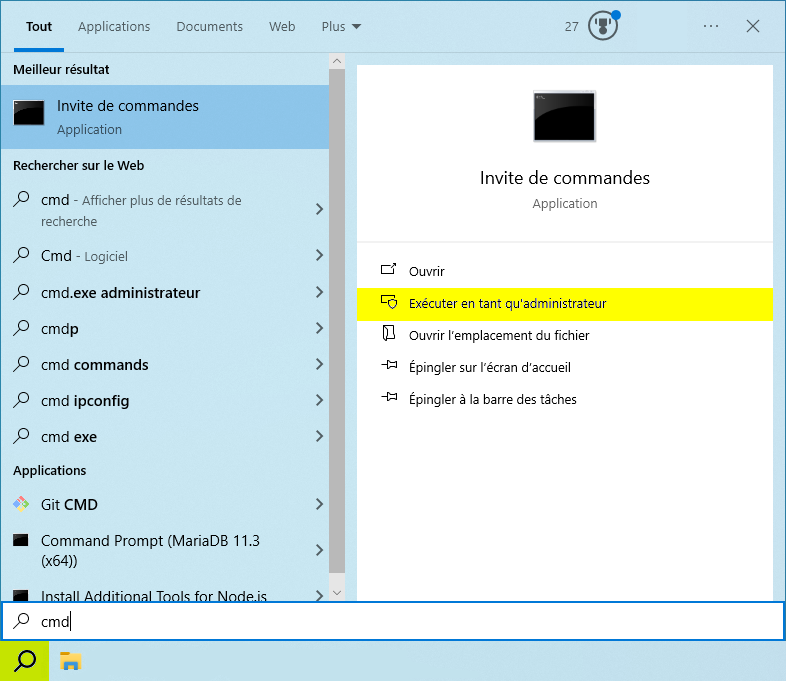

# Réinitialiser un ordinateur sous windows 10.

Dans cet article vous verrez la procédure à suivre
pour réinitialiser un ordinateur sous Windows 10.

**Auteur** : Alexandre Martel-Lafleur  
**Date de création** : 12 février 2024

## Prérequis

Pour être en mesure de créer un point de restauration vous aurez besoin d'avoir :
<ul>
   <li>Un ordinateur avec le système d'exploitation Windows 10.</li>
   <li>Les droits d'administration.</li>
</ul>

## Procédure avec interface graphique

<ol>
   <li>
    Ouvrez les paramètres à l'aide du menu **Démarrer** dans le coin inférieur gauche
    de l'écran. Référez-vous au numéro **1** sur l'image.

    Ensuite, un menu s'ouvrira. **Cliquez** sur l'icône d'engrenages 
    identifiée par le numéro **2** et le menu des paramètres s'ouvrira.

</li>

:::tip
Vous pouvez également utiliser le raccourci clavier **Windows + i** pour ouvrir les paramètres.
:::

<li>
   Une fois le menu des **paramètres** ouvert, cliquez sur l'onglet **Mise à jour et sécurité**.

</li>

<li>
 Cliquez sur l'onglet **Récupération** dans la barre latérale à gauche.

</li>

<li>
Une fois dans l'onglet récupréation, appuyez sur le bouton **Mise en route**.

</li>

<li>
Choisissez l'option **Garder mes fichiers**.

:::warning
Faites attention de ne pas choisir l'option **Supprime tout**, car vous allez perdre
tous vos fichiers personnels, toutes vos applis ainsi que tous vos paramètres
puisque ce sera une réinstallation de windows plutôt qu'une réinitialisation.
:::
</li>

<li>
Une fois cela fait, sélectionner le bouton **Réinstaller localement**.

</li>

<li>
Appuyer sur **Suivant** pour continuer.

</li>

<li>
Finalement, assurez-vous que vous avez les mêmes paramètres que ceux lister sur **l'image**
et si tout semble exact appuyez sur le bouton **Réinitialiser** afin de réinitialiser votre ordinateur.

</li>
</ol>  

## Procédure en ligne de commandes

<ol> 
<li>Ouvrez et exécuter une invite de commande en tant qu'**administrateur**
en inscrivant **"cmd"** dans la barre de recherche.
Ensuite, sélectionnez l'option **Exécuter en tant qu'administrateur**</li>

<li>Inscrivez la commande **systemreset** afin d'ouvrir le menu de réinitialisation du système.</li>

<li>
Choisissez l'option **Garder mes fichiers**.

:::warning
Faites attention de ne pas choisir l'option **Supprime tout**, car vous allez perdre
tous vos fichiers personnels, toutes vos applis ainsi que tous vos paramètres
puisque ce sera une réinstallation de windows plutôt qu'une réinitialisation.
:::
</li>

<li>
Une fois cela fait, sélectionner le bouton **Réinstaller localement**.

</li>

<li>
Appuyer sur **Suivant** pour continuer.

</li>

<li>
Finalement, assurez-vous que vous avez les mêmes paramètres que ceux lister sur **l'image**
et si tout semble exact appuyez sur le bouton **Réinitialiser** afin de réinitialiser votre ordinateur.

</li>

</ol>
   

   
